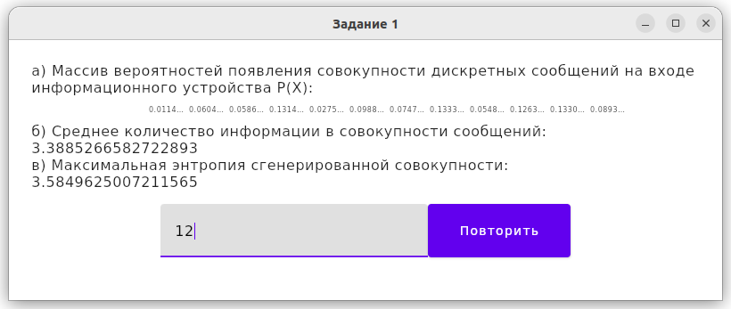
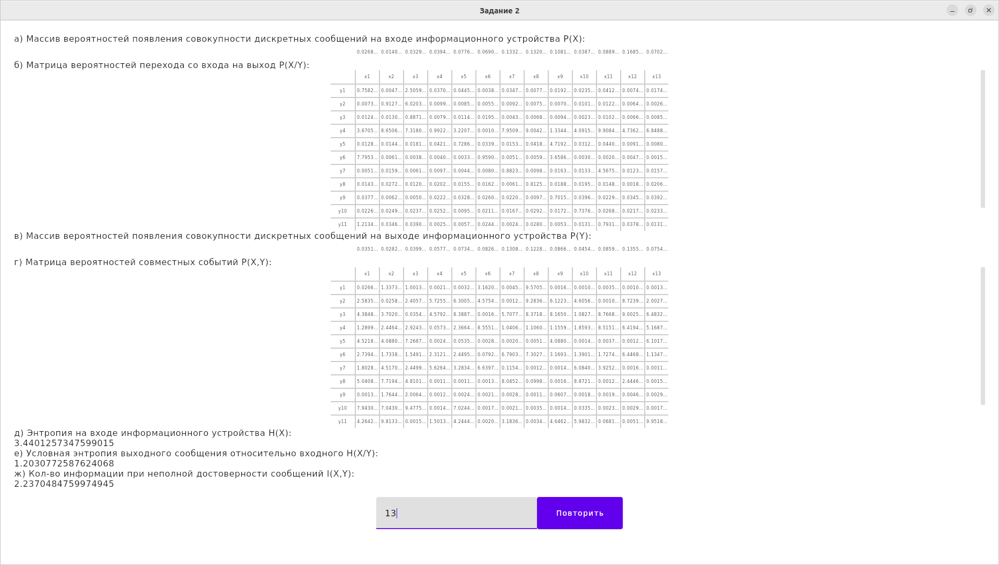
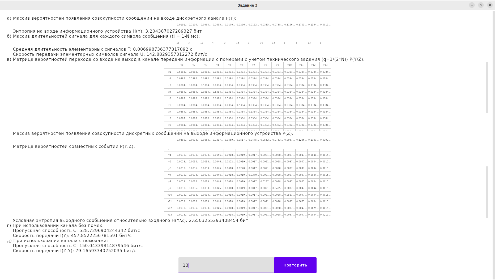
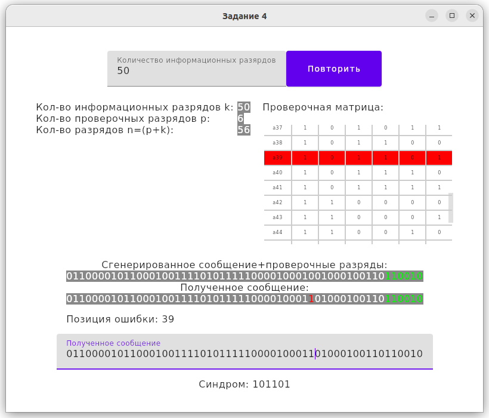
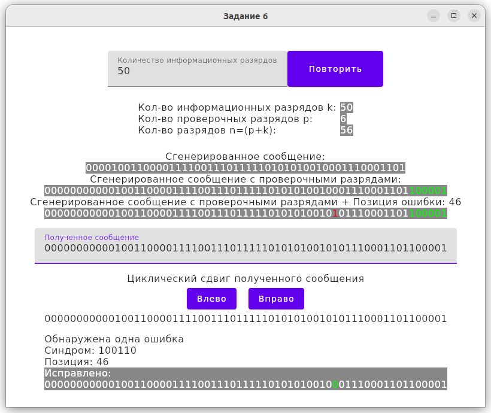

# TIK Лабораторные работы

#### Лабораторная работа №1 Количество информации и неопределенность сообщения
**Техническое задание:** на вход информационного устройства поступает совокупность
дискретных сообщений {𝑥i}, где i=1÷N. Вероятности появления дискретных сообщений на
входе задаются в виде счетчика случайных чисел. Необходимо разработать программное
обеспечение и провести комплекс численных экспериментов по расчету количества
информации и максимальной энтропии дискретных сообщений, поступающих на вход
информационного устройства.

#### Лабораторная работа №2 Количество информации при неполной достоверности сообщений
**Техническое задание:** на вход информационного устройства поступает совокупность
дискретных сообщений {xi}, где i=1÷N. Вероятности появления дискретных сообщений на
входе задаются в виде счетчика случайных чисел. Вероятности безошибочной передачи
сообщения составляют не менее 70%. Вероятности безошибочной передачи задаются
случайным образом. Вероятности ошибок генерируются счетчиком случайных чисел.
Необходимо разработать программное обеспечение и провести комплекс численных
экспериментов по расчету количества информации, получаемое при неполной
достоверности сообщений.

#### Лабораторная работа №3 Обобщенные характеристики сигналов и каналов
**Техническое задание:** источник информации вырабатывает информационный сигнал с N
различными символами. Вероятности появления символов на входе задаются в виде
счетчика случайных чисел. Длительность каждого символа генерируется случайным
образом во временном интервале (0÷N] мкс. Источник информации подключен к каналу
передачи сигналов. Канал передачи сигналов может работать как с помехами, так и без
помех. При работе канала с помехами вероятность ошибки в канале задается случайным
образом в интервале [0÷q], где q=1/(2‧N). Необходимо разработать программное
обеспечение и провести комплекс численных экспериментов по расчету пропускной
способности и скорости передачи информации при использовании канала без помех и
канала с помехами.

#### Лабораторная работа №4 СИСТЕМАТИЧЕСКИЙ КОД
**Техническое задание:** источник информации вырабатывает сообщения, содержащие k
информационных разрядов. Значения разрядов генерируются в двоичной системе
счисления счетчиком случайных чисел. Необходимо: 
1. разработать программное
обеспечение для передатчика, которое будет строить систематический код с заданной
исправляющей способностью; 
2. разработать программное обеспечение на приемной
стороне, позволяющее корректировать принятую ошибочную кодовую комбинацию; 
3. провести комплекс численных экспериментов, в ходе которых на передающей стороне
построить систематический код с заданной исправляющей способностью, сгенерировать
ошибочный систематический код, на приемной стороне вычислить позицию ошибки и
скорректировать принятую кодовую комбинацию.

#### Лабораторная работа №5 Код Хемминга
**Техническое задание:** источник информации вырабатывает сообщения, содержащие k
информационных разрядов. Значения разрядов генерируются в двоичной системе
счисления счетчиком случайных чисел. Необходимо: 
1. разработать программное
обеспечение для передатчика, которое будет строить код Хэмминга с заданной
исправляющей способностью; 
2. разработать программное обеспечение на приемной
стороне, позволяющее обрабатывать принятый код Хэмминга; 
3. провести комплекс численных экспериментов, в ходе которых на передающей стороне построить код
Хэмминга с заданной исправляющей способностью, сгенерировать случайным образом
кратность ошибки и ошибочную кодовую комбинацию, на приемной стороне по
принятому коду Хэмминга определить кратность ошибки и скорректировать принятую
кодовую комбинацию.

#### Лабораторная работа №6 Циклический код
**Техническое задание:** источник информации вырабатывает сообщения, содержащие k
информационных разрядов. Значения разрядов генерируются в двоичной системе
счисления счетчиком случайных чисел. Необходимо: 
1. разработать программное
обеспечение для передатчика, которое будет строить циклический код, позволяющий
обнаруживать и исправлять все однократные ошибки; 
2. разработать программное
обеспечение на приемной стороне, позволяющее обрабатывать принятый циклический код
и определять позицию ошибки;
3. провести комплекс численных экспериментов, в ходе
которых продемонстрировать работу системы «передатчик-приемник» с использованием
циклического кода.

